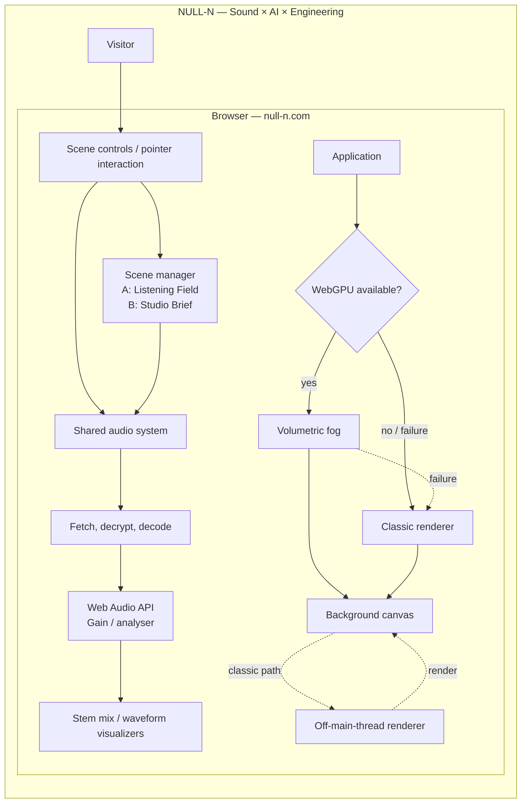
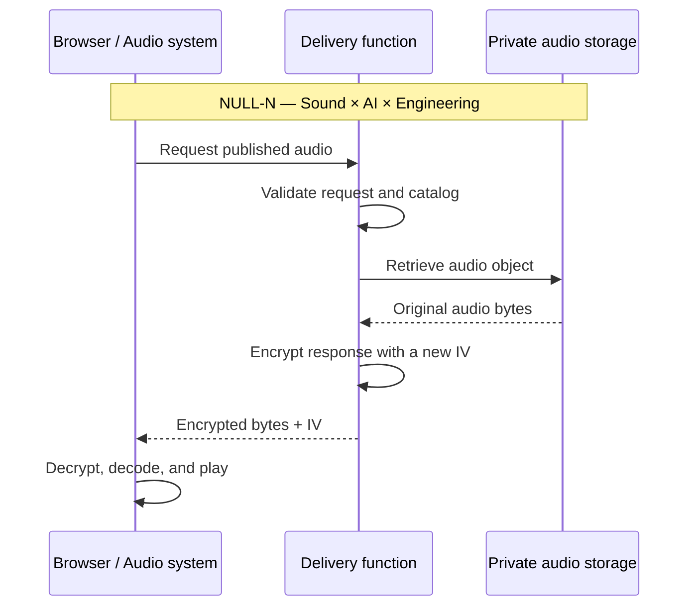

  <a href="https://null-n.com/"><strong>Visit null-n.com</strong></a>

# NULL-N

**Sound × AI × Engineering.**

NULL-NによるインタラクティブなWeb作品と、その技術ディレクションを読むための
公開ポートフォリオです。完成した体験を動かす本番実装ではなく、作品の構想、
判断、構造を公開用に編んだ記録を置いています。

**EN** 
This is a public portfolio for reading NULL-N’s interactive web work and its
technical direction. It is not the production implementation that runs the
finished experience; it is a curated record of the work’s concept, decisions,
and structure.

## The work

### A / Listening Field

訪問者が触れると、NULL-Nによるオリジナル楽曲の各ステムが5つの光点として
現れます。場の中を動くことで各音の存在感が変わり、カーソルがミックスの一部に
なる。楽曲は背景装飾ではなく、インタラクションそのものの表面です。

**EN** 
When the visitor engages, the individual stems of an original NULL-N
composition emerge as five points of light. Moving through the field changes
their relative presence, making the cursor part of the mix. The composition is
not background decoration; it is the surface of the interaction.

### B / Studio Brief

もう一方の場では、音、音声AI、Webエンジニアリングを横断する活動と、最初の
試作や納品のあとも伴走し続ける意志を、編集的なスタジオの紙面として示します。

**EN** 
The other scene presents a practice that moves across sound, voice AI, and web
engineering. It takes the form of an editorial studio page and states the
intention to remain involved after a first prototype or delivery.

## 署名とAI / Authorship and AI

**この作品の署名はNULL-Nです。** AIは、NULL-Nが方向を定める制作工程における
実装パートナーであり、その署名に代わるものではありません。

| 領域 / Area | 担当・署名 / Authorship |
| --- | --- |
| 音楽 — 作曲、演奏、制作 Music — composition, performance, production | NULL-N |
| クリエイティブディレクション — 構想、視覚言語、インタラクション Creative direction — concept, visual language, interaction | NULL-N |
| 技術ディレクション — 挙動、性能要件、細部の調整 Technical direction — interaction behavior, performance criteria, detailed adjustment | NULL-N |
| エンジニアリング、試作、反復 Engineering, prototyping, and iteration | NULL-NがAIとの対話を通して開発 Developed by NULL-N in dialogue with AI |

AIは、放っておけばこちらの意図とは別の最適化へすぐ走る。品質を一切落とさず、
改善だけを積み重ねるには、指示・観察・検証・修正を何度も往復する必要があった。
大変だった。でも、その往復が面白い。

**EN** 
**The signature of this work is NULL-N.** AI takes part as an implementation
partner within a NULL-N-directed process; it does not stand in for that
signature.

Left unchecked, AI quickly optimizes for something other than the intent.
Keeping the quality intact while accumulating only improvements required
repeated cycles of direction, observation, verification, and correction.
It was difficult. But that exchange was interesting.

## 技術的な判断 / Technical direction

この公開リポジトリでは、完成品のソースではなく、以下の設計判断を読める形で
残します。

- **音を操作面にする** — 楽曲を背景へ退かせず、ステムの相対的な聴こえ方を
  インタラクションとして扱う。
- **描画を環境に合わせる** — WebGPUを優先し、利用できない・失敗した場合だけ
  軽いクラシック描画へ退避する。
- **原音と公開ソースを分ける** — マスターをGitへ入れず、配信にだけ必要な境界を
  設ける。
- **AIを実装者として扱う** — 要件、視覚、性能、受け入れ基準はNULL-Nが定め、
  AIとの反復によって実装を詰める。

**EN** 
This public repository preserves the following decisions rather than the
complete production source.

- **Make the composition the interface** — Keep the music out of the
  background by treating relative stem presence as interaction.
- **Adapt rendering to the environment** — Prefer WebGPU, then retreat to a
  lighter classic renderer only when it is unavailable or fails.
- **Separate original audio from public source** — Keep masters out of Git and
  create only the boundary needed for delivery.
- **Treat AI as an implementation partner** — NULL-N defines requirements,
  visuals, performance, and acceptance criteria; implementation is refined
  through iteration with AI.

Further notes: [Technical direction](./docs/TECHNICAL-DIRECTION.md)

## 音源の取り扱いと配信境界 / Asset handling and delivery boundary

この配信境界は、Cloudflareに置く原音をどう扱うべきかというNULL-N自身の問いから
設計したものです。完全な秘匿を装うのではなく、ブラウザ再生という前提を受け入れた
うえで、原音を公開ソースから切り離し、配信経路を必要な範囲へ限定する。そのために
到達した、現時点での一つの答えです。

**EN** 
This delivery boundary began with NULL-N's own question of how original audio
stored on Cloudflare should be handled. It does not pretend absolute secrecy.
Instead, it accepts the premise of browser playback while separating the audio
from public source and limiting the delivery path to what is needed. It is one
answer reached so far.

This is not DRM and does not claim to make copying impossible. A browser that
can play the audio cannot keep it completely secret. The purpose is to separate
the original audio from static public URLs and unrestricted direct links: a
delivery boundary for the audio itself.

## 実装設計図 / Implementation architecture

## 公開範囲 / Public scope

本番の実装リポジトリは非公開です。ここには、完成した作品を読むために必要な
構想・設計判断・公開可能な図だけを載せます。原音マスター、運用設定、完全な
実装、非公開の制作資料は含めません。

**EN** 
The production implementation repository is private. This repository contains
only the concept, design decisions, and public diagrams needed to read the
finished work. It does not include original masters, operational settings, the
complete implementation, or private production material.

## License

Copyright © 2026 NULL-N. All rights reserved.

This repository is published for reading the work and its construction. No
permission is granted to copy, modify, distribute, or reuse its source, design,
assets, or music without explicit written consent. See [LICENSE](./LICENSE).
